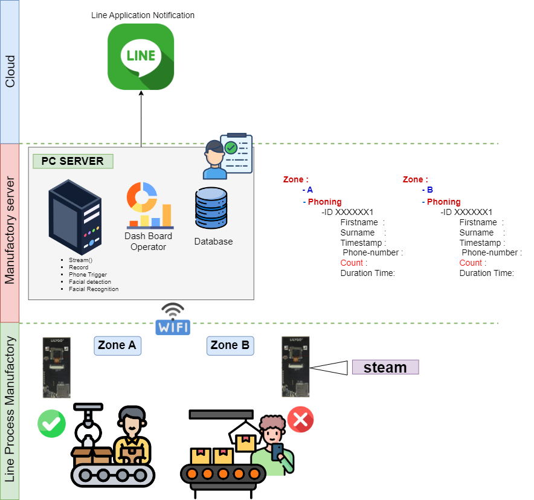
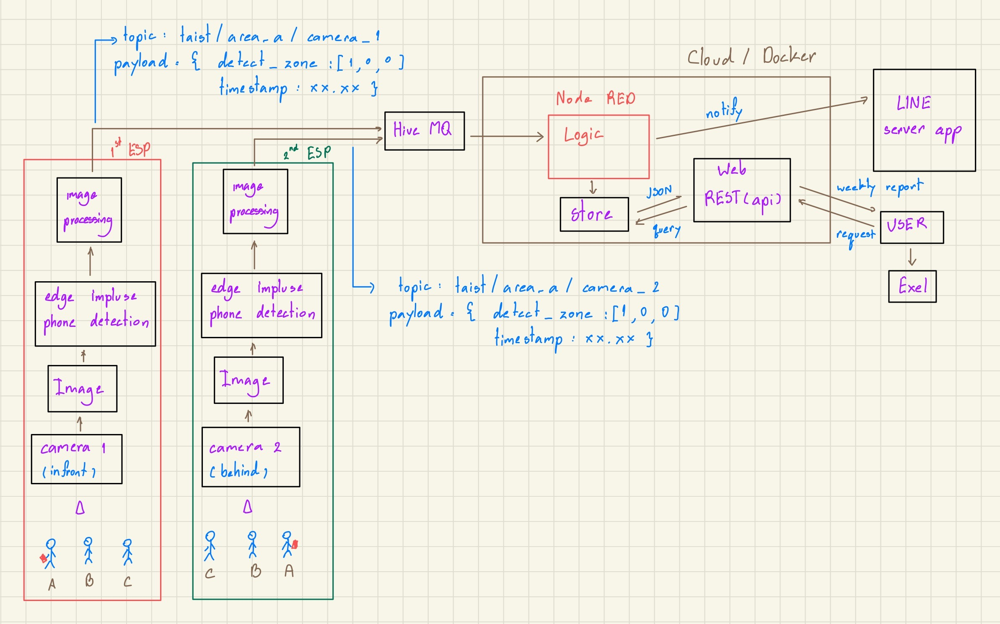
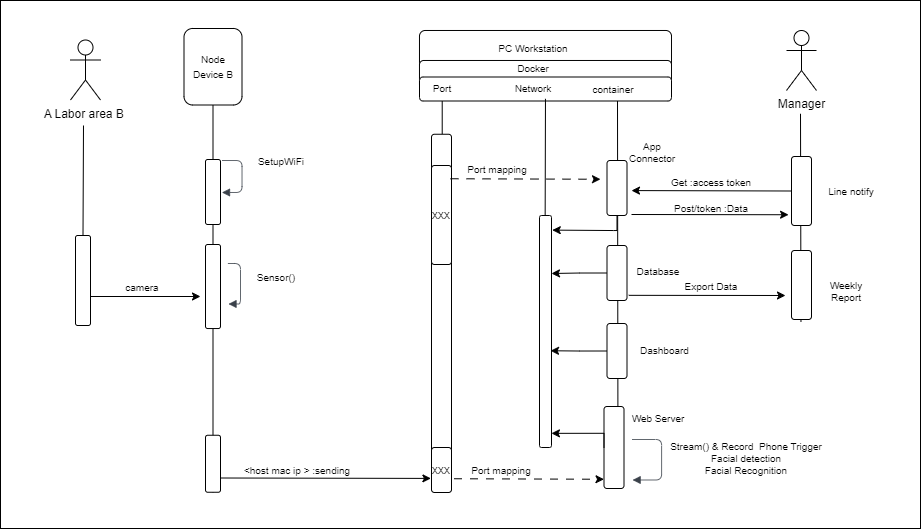
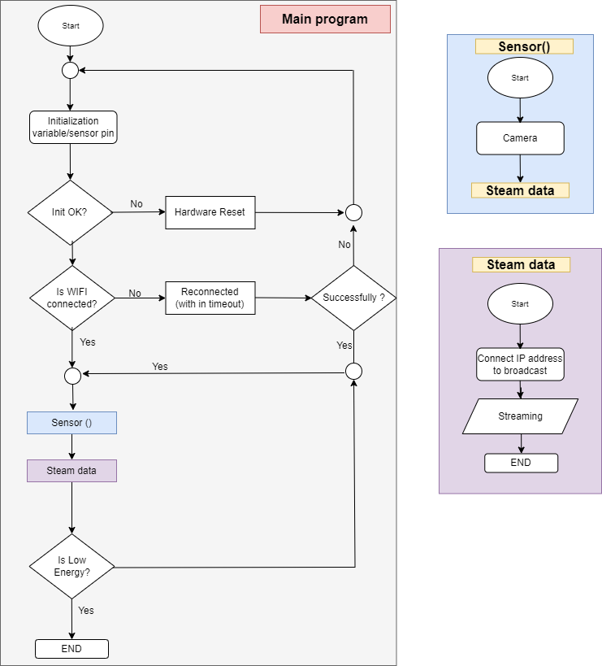
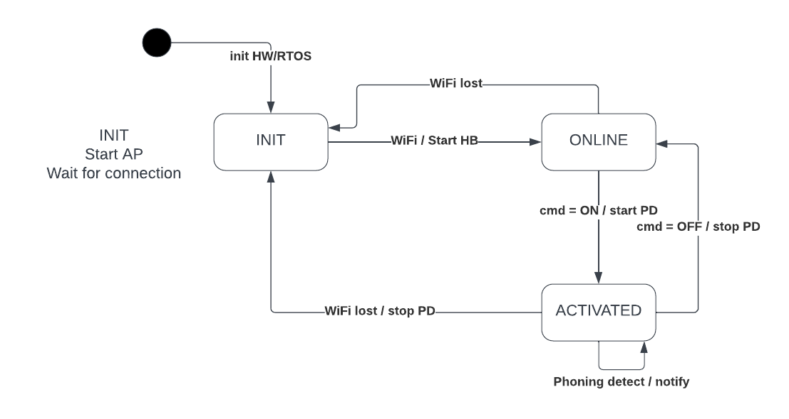

## ICT720_Project_AIoT4 Smart refrigerator

More in-depth details about the project can be read at:
https://medium.com/@watthanai2540/taist2024-smart-refrigerator-lab-a1aee4804ed5

  
Table of Contents

  <ol>
    <li>
      <a href="#Domain:-Smart-Home">Domain: Smart Production Line</a>
      <ul>
        <li><a href="#Stakeholder">Stakeholder</a></li>
        <li><a href="#User-stories">User stories</a></li>
      </ul>
    </li>
    <li>
      <a href="#overview">Getting Started</a>
      <ul>
        <li><a href="#overview">Overview</a></li>
        <li><a href="#architecture">Architecture</a></li>
        <li><a href="#Sequence-Diagram">Sequence Diagram</a></li>
        <li><a href="#machine-diagram">Machine Diagram</a></li>
        <li><a href="#device-operation">Device operation</a></li>
      </ul>
    </li>
    <li><a href="#database-diagram">Database</a></li>
    <li><a href="#training-model">Model Training</a></li>
  </ol>

### 🏢 Domain: Smart Home
#### Stakeholder
1. Refrigerator user
2. Refrigerator services organization

#### User stories
 1. As a user, I want to monitor information about my registered refrigerator(s). 
     - acceptance criteria #1: I can register my refrigerator on the LINE application.
     - acceptance criteria #2: I can know the number of goods in my smart refrigerator.
     - acceptance criteria #3: I can monitor data and status on the dashboard of my registered device(s).
     - acceptance criteria #4: I receive a notification every day or nearly every day about unavailable goods in my device(s)."

 2. As a a refrigerator services organization, we want to know the total number of devices requiring service, along with the usage status of all devices in each area. 
     - acceptance criteria #1: We are able to check the devices that are already registered.
     - acceptance criteria #2: We have the capability to register new devices and remove old ones.
     - acceptance criteria #3: We can view the status of the devices when they are registered by users.
     - acceptance criteria #4: We can monitor all of the devices on dashboard

### Overview

  

### Architecture

  

### Sequence Diagram
<ul>
<li><b style="color:rgb(46, 204, 113)">Files Editor via Draw.io : Grant some people can access</b>
<pre><a href="url">https://drive.google.com/file/d/1w9EUjGDnG5Px11Vg9m29VN9QPpMQNrPN/view?usp=sharing</a> </li>
</ul>

  

 ### Machine Diagram
 

  

### Device operation

  

### 👩🏻‍💻 Our Members
1. Wathanai Luealamai 6614552627  
2. Kiattisak Phetmeesri 6614552635  
3. Thanaphum Withiso 6614552597  

