## ICT720_Project_AIoT4 Smart refrigerator

More in-depth details about the project can be read at:
https://medium.com/@watthanai2540/taist2024-smart-refrigerator-lab-a1aee4804ed5

<p align="center">
 <br></p>

[]()

 <!-- TABLE OF CONTENTS -->
<details>
  <summary>Table of Contents</summary>
  <ol>
    <li>
      <a href="#Introduction">Introduction</a>
      <ul>
        <li><a href="#Stakeholder">Stakeholder</a></li>
        <li><a href="#User-stories">User stories</a></li>
      </ul>
    </li>
    <li>
      <a href="#Getting-Started">Getting Started</a>
      <ul>
        <li><a href="#What-is-this-?">What is this ?</a></li>
        <li><a href="#System-Architecture-&-Sequence-Diagram">System Architecture & Sequence Diagram</a></li>
      </ul>
    </li>
    <li><a href="#Node-Device">Node-Device</a>
        <ul>
            <li><a href="#Hardware">Hardware</a></li>
            <li><a href="#Software">Software</a>
                <ul>
                    <li><a href="#Create-ML-Library">Create ML Library</a></li>
                    <li><a href="#Testing-ML-Library">Testing ML Library</a></li>
                    <li><a href="#Final-Deployment">Final Deployment</a></li>
                </ul>
            </li>
        </ul>
    </li>
    <li>
      <a href="#Workstation-on-Docker">Workstation on Docker</a>
      <ul>
        <li><a href="#MQTT-broker">MQTT broker</a></li>
        <li><a href="#MySQL">MySQL</a></li>
        <li><a href="#Node-Red">Node-Red</a></li>
        <li><a href="#Grafana">Grafana</a></li>
        <li><a href="#Taist-dev-api">Taist dev api</a></li>
        <li><a href="#Taist-bot-api">Taist bot api</a></li>
      </ul>
    </li>
    <li>
      <a href="#Data-pipeline-on-Node-Red">Data pipeline on Node-Red</a>
      <ul>
        <li><a href="#Calculate-Data">Calculate Data</a></li>
        <li><a href="#Line-bot-application">Line bot application</a></li>
      </ul>
    </li>
    <li>
      <a href="#Dashboard">Dashboard</a>
    </li>
   
  </ol>
</details>

## Introduction

<p align= "left">The content in this article serves as an example of how to create and design IoT system, from receiving data to monitoring. The team is interested in utilizing machine learning (ML) at the microcontroller level for various electrical applications such as refrigerators, hence the focus of this topic. This project received support form the Lilygo T-simcam board through the TAIST2024 campus in the ICT720 software design course. The board utilizes the Espressif esp32s3 processor, which includes a sensor, camera, and microphone built into it for easy integration wiht “Edage AI work”.</b> </p>
<p align="center">
 <br></p>
 <a href="https://www.hackster.io/news/lilygo-s-t-simcam-offers-optional-cellular-connectivity-for-your-edge-computer-vision-projects-eb38c8cc7727">Reference: LilyGO's T-SIMCam offers optional cellular connectivity for your edge computer vision projects</a>

### Stakeholder

1. Refrigerator services
2. User

### User stories

1. As a team refrigerator services, They want to know the total number of devices that need to be serviced, including the usage status of all devices in each area.

   - acceptance criteria #1 : They can check stock devices already register .
   - acceptance criteria #2 : They can register new devices and remove old devices.
   - acceptance criterial #3 : They can see status updated when devices were registered by user.

   - acceptance criterial #4 : They can monitor all of devices product on dashboard

---

2. As a user, They want to get information a number of goods in their smart refrigeration.

   - acceptance criterial #1 : They can register their refrigeration on line application

   - acceptance criterial #2 : They can monitoring data and status on dashboard

<p align="right">(<a href="#top">back to top</a>)</p>

## Getting Started

### What is this ?

<p align= "left">This device serves as an experimental example of counting products in a virtual refrigerator using a camera sensor to detect objects. while, the button switch, can detect the opening and closing of the cabinet. That is prepared to send updated information on product quantity status stored in a database to make it easy display on the dashboard. </p>

<div align="center">
    
     
</div>

--------------------------------------------

### How does it work ?

<a href="https://youtu.be/Z9n4O8rY3i4">How does it work? : Refrigeration 01
</a>

<p align= "left">In this case, we have designed the device to transmit data in two parts: sending the working status, or what we will refer to as its heartbeat in future content. The next section will involve sending status updates on the quantity of equipment products. Here are the steps outlined in the block diagram figure below: when someone opens and closes the cabinet, after every 5 seconds, the system will detect the number of products in the cabinet and send this information for recording in the database for a period of 10 seconds, after which it returns to the heartbeat state. </p>

--------------------------------------------

### System Architecture & Sequence Diagram

<p align= "left">From the picture, it is divided into three parts, consisting of node devices: line application, workstation to manage data management, and display system, which will be discussed in the next section. </p>
<div align="center">
     
</div>

<p align="right">(<a href="#top">back to top</a>)</p>


## Node-Device

### Hardware design
<div>
      <ul>
        <li>2 x Led white: Forward Voltage 3.3–3.4</li>
        <li>1 x push button switch</li>
        <li>3 x 100 ohm</li>
        <li>1 x R&D cabinet</li>
        <li>1 x Lilygo T-simcam board</li>
      </ul>
</div>
<div align="center">
     
</div>

-------------------------------------------------------------------------

### Software design
<div align="center">
     
</div>

#### Create ML Library

--------------------------------

#### Testing ML Library

--------------------------------

#### Final Deployment

--------------------------------

<p align="right">(<a href="#top">back to top</a>)</p>

## Workstation Docker container
<p align= "left">For running applications across various workstations in different environments, we utilize the Docker platform to manage operations for each new edit and redeployment. Typically, Docker Desktop aids in this management process. However, in this article, the computer resources owned is not enough to process. Therefore, the alternative is renting a VPS ( virtual private server) to run Ubuntu . The process begins with installing Docker using a scrip file. </p>

 <a href="https://docs.docker.com/engine/install/ubuntu/#install-using-the-convenience-script">Ref : Docker engine install ubuntu</a>


<div align="center">
     
</div>

 <p align= "left">After installing Docker, we will install portainer to manage container services and network. 
  <a href="https://docs.portainer.io/start/install/server/swarm/linux">Ref : Install portainer</a> </p>

 <p align= "left">you can use GUI in setup docker yaml in stacks or docker command is
docker compose -f {{filename}}.yaml up — build -d</p>

-----------------------------------

### MQTT broker


   ```sh 
version: "3.7"
services:
  emqx:
  image: emqx/emqx
  container_name: emqx
  ports:
  - "18083:18083" # dashboard
  - "1883:1883" # mqtt
  - "8883:8883" # mqtts
  - "8081:8081" # dashboard api
  - "8083:8083" # ws
  - "8084:8084" # wss
  volumes:
  - /TAIST2024/emqx/data:/opt/emqx/data/mnesia
  environment:
  - TZ=Asia/Bangkok
  networks:      
              - mysql_net

networks:  
      mysql_net:    
          external: true

  ```
  <div align="center">
     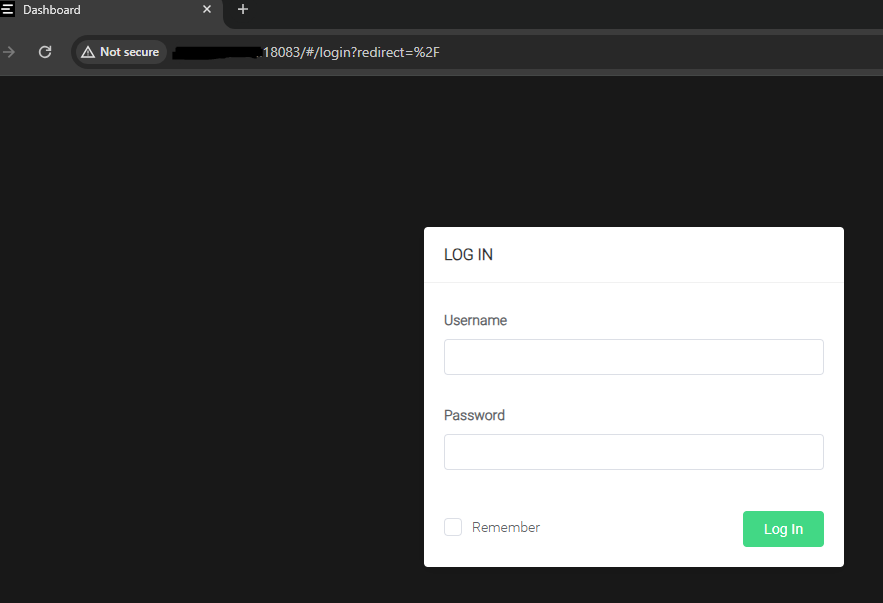
    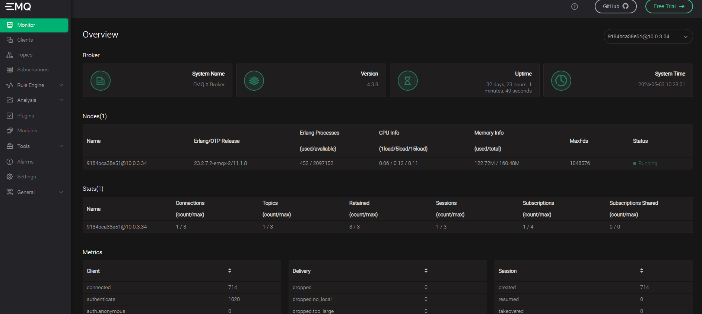
</div>

-------------------

### MySQL
   ```sh 
version: "3.7"
services:
  mysql:
  image: mysql:8
  container_name: mysql
  ports:
  - 3306:3306
  volumes:
  - /TAIST2024/mysql/data:/var/lib/mysql
  - /TAIST2024/mysql/etc:/etc/mysql/conf.d
  environment:
  - TZ=Asia/Bangkok
  - MYSQL_ROOT_PASSWORD=xxxxxxxxx
  networks:      
              - mysql_net

networks:  
      mysql_net:    
          external: true

  ```

<div align="center">
     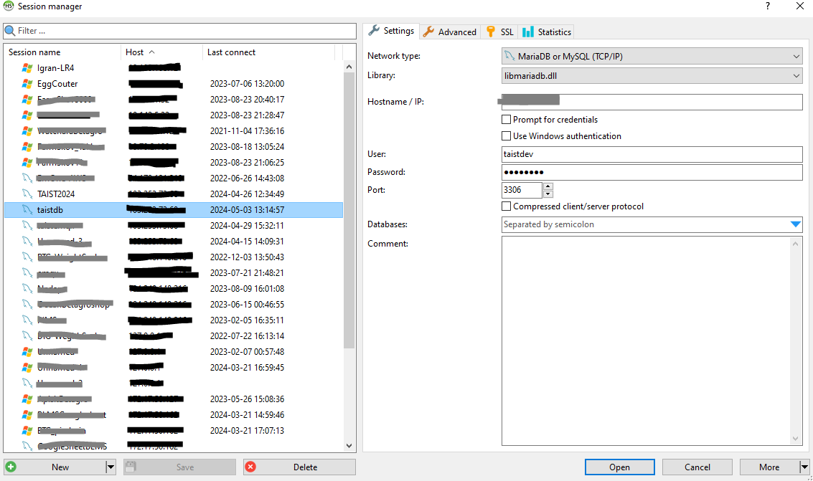
</div>

------------------

### Node-Red

   ```sh 
version: "3.7"
services:
    node-red:
         image: nodered/node-red
         ports:
            - 1880:1880
         volumes:
            - /TAIST2024/node-red/data:/data
         environment:
            - TZ=Asia/Bangkok

  ```

  
<div align="center">
     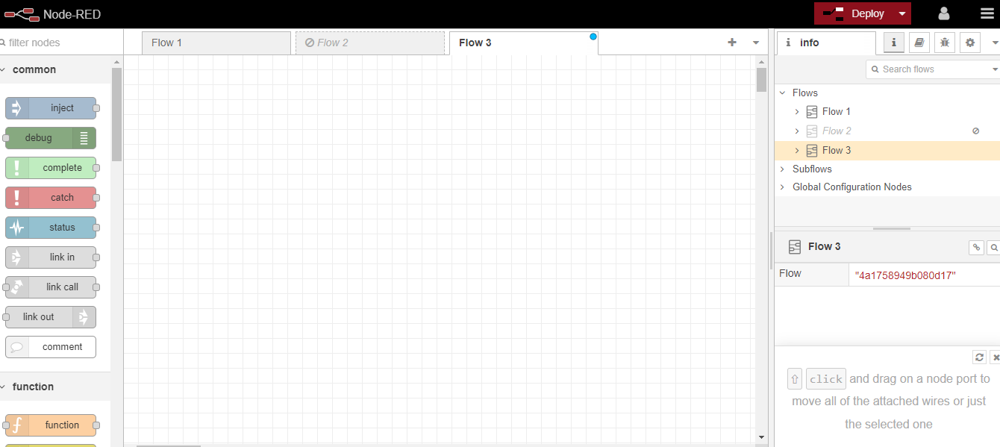
</div>

-----------

### Grafana

   ```sh 
version: "3.7"
services:
   grafana:
       image: grafana/grafana
       container_name : grafana
       ports:
            - 3000:3000
      volumes:
            - /TAIST2024/grafana/data:/var/lib/grafana
            - /TAIST2024/grafana/plugins:/var/lib/grafana/plugins
      environment:
            - TZ=Asia/Bangkok
       networks:      
             - mysql_net

networks:  
      mysql_net:    
          external: true

  ```

<div align="center">
     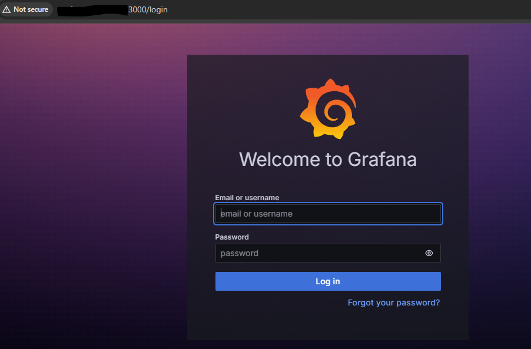
</div>


-----------

## Taist dev api


<p align= "left">xxxxxxxxxxxxxxxxxxxxxxxxxxxxxxxxxx</p>
<div align="center">
     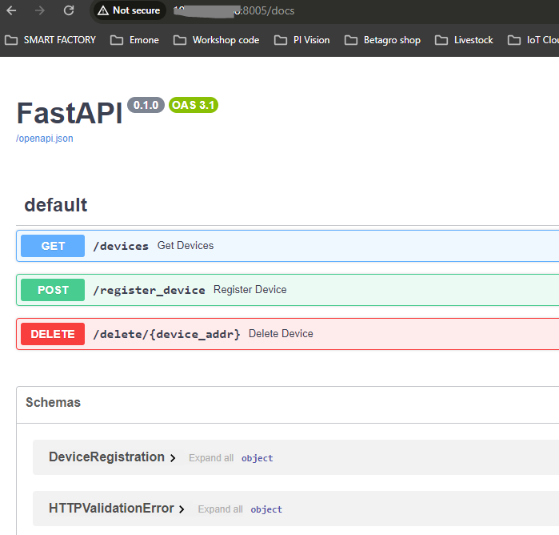
</div>

 <p align= "left">method @get xxxxxxxxxxxxxxxxxxxxx </p>

   ```sh 
@app.get("/devices", response_model=List[DeviceRegistration])
def get_devices():
    # Commit any pending transactions to ensure data consistency
    mydb.commit()
    # Fetch devices from MySQL
    mycursor.execute("SELECT * FROM dev_registor_db")
    devices = mycursor.fetchall()
    device_list = []
    for device in devices:
        device_obj = DeviceRegistration(
            device_name=device[0],
            device_addr=device[1],
            branch_name=device[2],
            status=device[3],
            created_time=device[4],
            update_time=device[5],
            Latitude=device[6],
            Longtitude=device[7],
            status_registor=device[8],
            create_registor=device[9]
        )
        device_list.append(device_obj)
    return device_list
  ```

 -----------------------------------

 <p align= "left">method @post xxxxxxxxxxxxxxxxxxxxx </p>

  ```sh 

  xxxxx

  ```

  -----------------------------------

 <p align= "left">method @Delete xxxxxxxxxxxxxxxxxxxxx </p>

   ```sh 

  xxxxx

  ```

-----------

## Taist bot api
 <p align= "left">QR coede.html </p>
 
<div align="center">
     
</div>

  ```sh 
version: '3.8‘
services:  
taist_bot_app:    
  build: .    
  container_name: taist_bot_app    
  image: taist_bot_app_image    
  env_file:    .env    
  ports:     
  - ${LINE_WEBHOOK_PORT}:${LINE_WEBHOOK_PORT}    
  volumes:     
  - .:/code
  ```

  -----------------------------------

 <p align= "left">method @Delete xxxxxxxxxxxxxxxxxxxxx </p>

   ```sh 

  xxxxx

  ```

<p align="right">(<a href="#top">back to top</a>)</p>

## Data pipeline on Node-Red

<div align="center">
     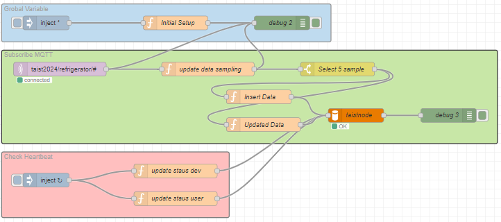
</div>


### Calculate Data


------------------

### Line bot application

<p align= "left"> When an event, such as filling in text, occurs, the line system will send information in the form of an HTTP POST request to the webhook URL that we’ve connected. We’ll refer to the message coming from Line as a webhook event, and we’ll process it before replying and continuing with the chatbot interaction. </p>

<div align="center">
     
      
</div>

---------------------------

<div align="center">
     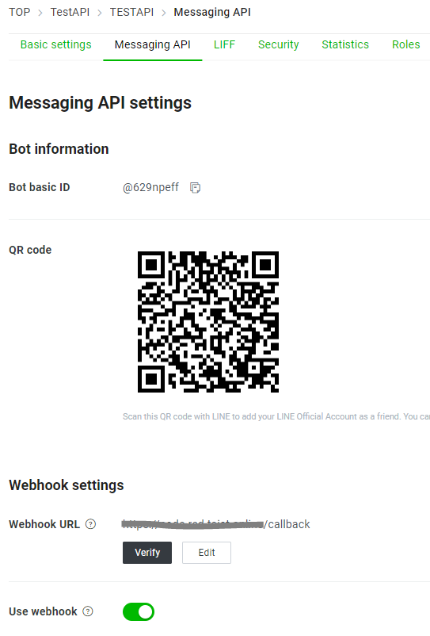
      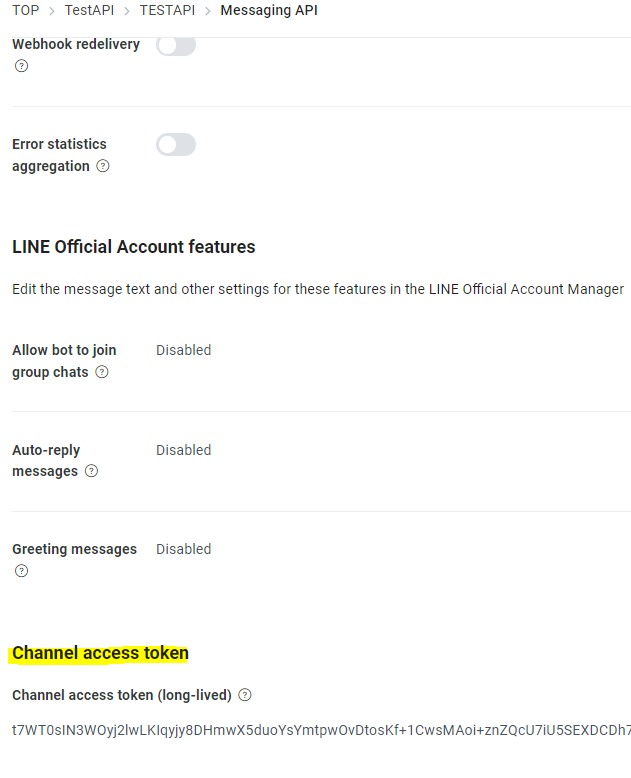
      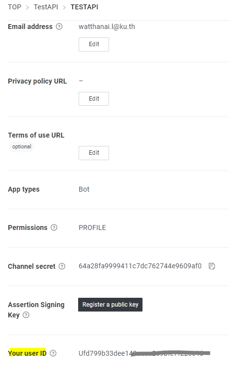
</div>

--------
<div align="center">
     
</div>

<p align="right">(<a href="#top">back to top</a>)</p>

   ```sh 
var reply1=msg.payload.reply1
var reply2=msg.payload.reply2

msg.payload = {
    to: 'Ufd799b33dee14xxxxxxxxxx',
    messages: [reply1, reply2]
}
msg.channelAccessToken = "t7WT0sIN3WOyj2lwLKIqyjy8DHxxxxxxxx"
msg.headers = {
    "Content-Type": "application/json",
    "Authorization": "Bearer " + msg.channelAccessToken
};

return msg;

  ```


## Dashboard

<p align= "left"> Grafana is a multi-platform open source analytics and interactive visualization web application. It can produce charts, graphs, and alerts for the web when connected to supported data sources. </p>
<div align="center">
     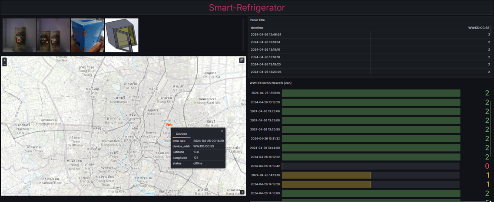
</div>

<p align="right">(<a href="#top">back to top</a>)</p>