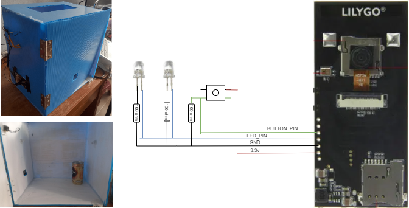

## ICT720_Project_AIoT4 Smart refrigerator

More in-depth details about the project can be read at:
https://medium.com/@watthanai2540/taist2024-smart-refrigerator-lab-a1aee4804ed5

  

 <!-- TABLE OF CONTENTS -->

  
Table of Contents

  <ol>
    <li>
      <a href="#Introduction">Introduction</a>
      <ul>
        <li><a href="#Stakeholder">Stakeholder</a></li>
        <li><a href="#User-stories">User stories</a></li>
      </ul>
    </li>
    <li>
      <a href="#Getting-Started">Getting Started</a>
      <ul>
        <li><a href="#What-is-this-?">What is this ?</a></li>
        <li><a href="#System-Architecture-&-Sequence-Diagram">System Architecture & Sequence Diagram</a></li>
      </ul>
    </li>
    <li><a href="#Node-Device">Node-Device</a>
        <ul>
            <li><a href="#Hardware">Hardware</a></li>
            <li><a href="#Software">Software</a>
                <ul>
                    <li><a href="#Create-ML-Library">Create ML Library</a></li>
                    <li><a href="#Testing-ML-Library">Testing ML Library</a></li>
                    <li><a href="#Final-Deployment">Final Deployment</a></li>
                </ul>
            </li>
        </ul>
    </li>
    <li>
      <a href="#Workstation-Docker-container">Workstation Docker container</a>
      <ul>
        <li><a href="#MQTT-broker">MQTT broker</a></li>
        <li><a href="#Data-pipeline">Data pipeline</a></li>
        <li><a href="#Dashboard">Dashboard</a></li>
      </ul>
    </li>
    <li>
      <a href="#Data-pipeline-<Node-Red>">Getting Started</a>
      <ul>
        <li><a href="#Calculate-Data">Calculate Data</a></li>
        <li><a href="#Line-bot-application">Line bot application</a></li>
      </ul>
    </li>
    <li>
      <a href="#Fastapi-&-index.html">Fastapi & index.html</a>
    </li>
    <li>
      <a href="#Config-Dashboard">Config Dashboard</a>
    </li>
   
  </ol>

## Introduction

The content in this article serves as an example of how to create and design IoT system, from receiving data to monitoring. The team is interested in utilizing machine learning (ML) at the microcontroller level for various electrical applications such as refrigerators, hence the focus of this topic. This project received support form the Lilygo T-simcam board through the TAIST2024 campus in the ICT720 software design course. The board utilizes the Espressif esp32s3 processor, which includes a sensor, camera, and microphone built into it for easy integration wiht “Edage AI work”.</b> 

  

 <a href="https://www.hackster.io/news/lilygo-s-t-simcam-offers-optional-cellular-connectivity-for-your-edge-computer-vision-projects-eb38c8cc7727">Reference: LilyGO's T-SIMCam offers optional cellular connectivity for your edge computer vision projects</a>

### Stakeholder

1. Refrigerator services
2. User

### User stories

1. As a team refrigerator services, They want to know the total number of devices that need to be serviced, including the usage status of all devices in each area.

   - acceptance criteria #1 : They can check stock devices already register .
   - acceptance criteria #2 : They can register new devices and remove old devices.
   - acceptance criterial #3 : They can see status updated when devices were registered by user.

   - acceptance criterial #4 : They can monitor all of devices product on dashboard

---

2. As a user, They want to get information a number of goods in their smart refrigeration.

   - acceptance criterial #1 : They can register their refrigeration on line application

   - acceptance criterial #2 : They can monitoring data and status on dashboard

(<a href="#top">back to top</a>)

## Getting Started

### What is this ?

This device serves as an experimental example of counting products in a virtual refrigerator using a camera sensor to detect objects. while, the button switch, can detect the opening and closing of the cabinet. That is prepared to send updated information on product quantity status stored in a database to make it easy display on the dashboard. 

    
     

--------------------------------------------

### How does it work ?

<a href="https://youtu.be/Z9n4O8rY3i4">How does it work? : Refrigeration 01
</a>

In this case, we have designed the device to transmit data in two parts: sending the working status, or what we will refer to as its heartbeat in future content. The next section will involve sending status updates on the quantity of equipment products. Here are the steps outlined in the block diagram figure below: when someone opens and closes the cabinet, after every 5 seconds, the system will detect the number of products in the cabinet and send this information for recording in the database for a period of 10 seconds, after which it returns to the heartbeat state. 

--------------------------------------------

### System Architecture & Sequence Diagram

From the picture, it is divided into three parts, consisting of node devices: line application, workstation to manage data management, and display system, which will be discussed in the next section. 

     

(<a href="#top">back to top</a>)

## Node-Device

### Hardware design

      <ul>
        <li>2 x Led white: Forward Voltage 3.3–3.4</li>
        <li>1 x push button switch</li>
        <li>3 x 100 ohm</li>
        <li>1 x R&D cabinet</li>
        <li>1 x Lilygo T-simcam board</li>
      </ul>

     

-------------------------------------------------------------------------

### Software design

     

#### Create ML Library

--------------------------------

#### Testing ML Library

--------------------------------

#### Final Deployment

--------------------------------

(<a href="#top">back to top</a>)

## Workstation Docker container

### MQTT broker

-------------------

### Data pipeline

------------------

### Databases

-----------

### Dashboard

----------